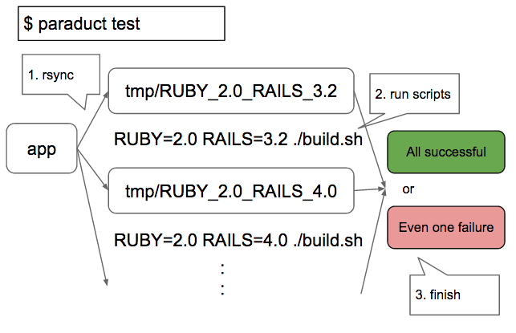

# Paraduct
[](http://badge.fury.io/rb/paraduct)
[](https://travis-ci.org/sue445/paraduct)
[](https://codeclimate.com/github/sue445/paraduct)
[](https://coveralls.io/r/sue445/paraduct)

Paraduct (**parallel** + **parameterize** + **product**) is matrix test runner

[](http://waffle.io/sue445/paraduct)

## Architecture


## Requirements
* ruby 2.0+
* rsync

## Installation

Add this line to your application's Gemfile:

```ruby
gem 'paraduct'
```

And then execute:

    $ bundle

Or install it yourself as:

    $ gem install paraduct

## Usage
```bash
$ paraduct --help
Commands:
  paraduct generate        # generate .paraduct.yml
  paraduct help [COMMAND]  # Describe available commands or one specific command
  paraduct test            # run matrix test
```

### 1. Generate config file
```bash  
$ paraduct generate
      create  .paraduct.yml
      create  .paraduct_rsync_exclude.txt
```

### 2. Customize .paraduct.yml
```bash
$ vi .paraduct.yml
$ vi .paraduct_rsync_exclude.txt
```

### 3. Run test
```bash
$ paraduct test
```

## .paraduct.yml Format
```yaml
script: |-
  echo "[START] NAME1=${NAME1}, NAME2=${NAME2}"
after_script: |-
  echo "[END] NAME1=${NAME1}, NAME2=${NAME2}"
work_dir: tmp/paraduct_workspace
variables:
  NAME1:
    - value1a
    - value1b
  NAME2:
    - value2a
    - value2b
max_threads: 4
rsync_option:
  exclude_from: .paraduct_rsync_exclude.txt
exclude:
  - NAME1: value1a
    NAME2: value2b
```

### script
script to run

### after_script
script to run after both `script` successful and `script` failure

### work_dir
diretory to run

* own job is run under `work_dir/$PARADUCT_JOB_NAME`
* if `work_dir` is empty, own job is run under current directory. 
  * rsync is disabled

### variables
Parameters to be combined

* `$PARADUCT_JOB_NAME` is generated with variables

$PARADUCT_JOB_ID   | NAME1   | NAME2   | $PARADUCT_JOB_NAME            | current directory where the test is performed
------------------ | ------- | ------- | ----------------------------- | --------------------------------------------------
1                  | value1a | value2a | NAME1_value1a_NAME2_value2a   | tmp/paraduct_workspace/NAME1_value1a_NAME2_value2a
2                  | value1a | value2b | NAME1_value1a_NAME2_value2b   | tmp/paraduct_workspace/NAME1_value1a_NAME2_value2b
3                  | value1b | value2a | NAME1_value1b_NAME2_value2a   | tmp/paraduct_workspace/NAME1_value1b_NAME2_value2a
4                  | value1b | value2b | NAME1_value1b_NAME2_value2b   | tmp/paraduct_workspace/NAME1_value1b_NAME2_value2b

### max_threads
maximum concurrent execution number of jobs

### rsync_option
support only `exclude-from`

### exclude
exclude pattern from product variables

## Contributing

1. Fork it ( https://github.com/sue445/paraduct/fork )
2. Create your feature branch (`git checkout -b my-new-feature`)
3. Commit your changes (`git commit -am 'Add some feature'`)
4. Push to the branch (`git push origin my-new-feature`)
5. Create a new Pull Request
